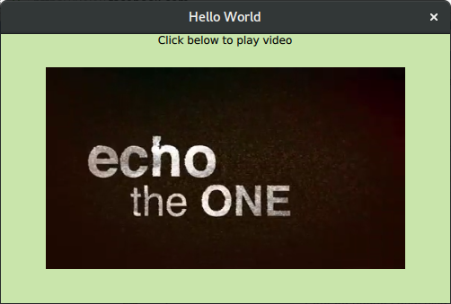

# docker-pyqt5-qml-qtmultimedia
Dockerfile for develop GUI application with Python 3 + PyQt5 + QML + QtMultimedia

Tested on Ubuntu 16.04, 16.10

https://github.com/fadawar/docker-pyqt5-qml-qtmultimedia

https://hub.docker.com/r/fadawar/docker-pyqt5-qml-qtmultimedia/

## How to use
You can clone github repository and then run this command to check if it's working

**Run**
```
docker run -it \
    -v /tmp/.X11-unix:/tmp/.X11-unix \
    -v $(pwd)/test:/app \
    -e DISPLAY=$DISPLAY \
    -u qtuser \
    --group-add audio \
    --device /dev/snd \
    fadawar/docker-pyqt5-qml-qtmultimedia python3 /app/hello.py
```

You should see window similar to this:



**Build**
```
docker build -t fadawar/pyqt5-qml-qtmultimedia .
```

## Other Dockerfiles
**Python 3 + PyQt5:**
https://github.com/fadawar/docker-pyqt5
 
**Python 3 + PyQt5 + QML:**
https://github.com/fadawar/docker-pyqt5-qml

**Python 3 + PyQt5 + QML + QtMultimedia:**
https://github.com/fadawar/docker-pyqt5-qml-qtmultimedia
